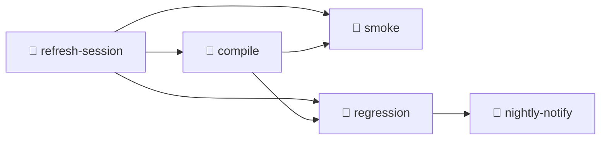
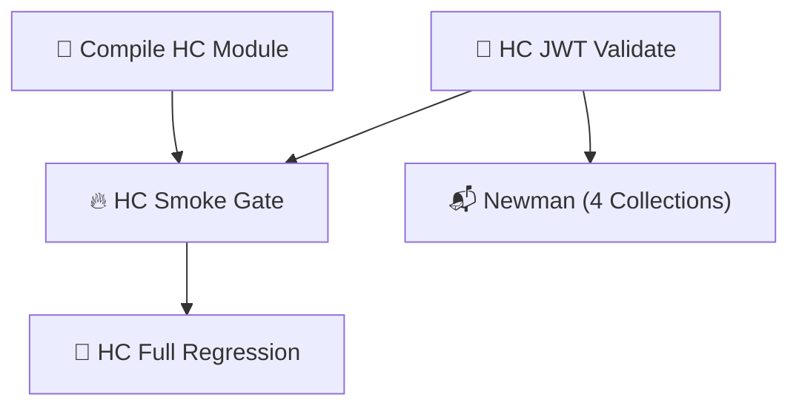
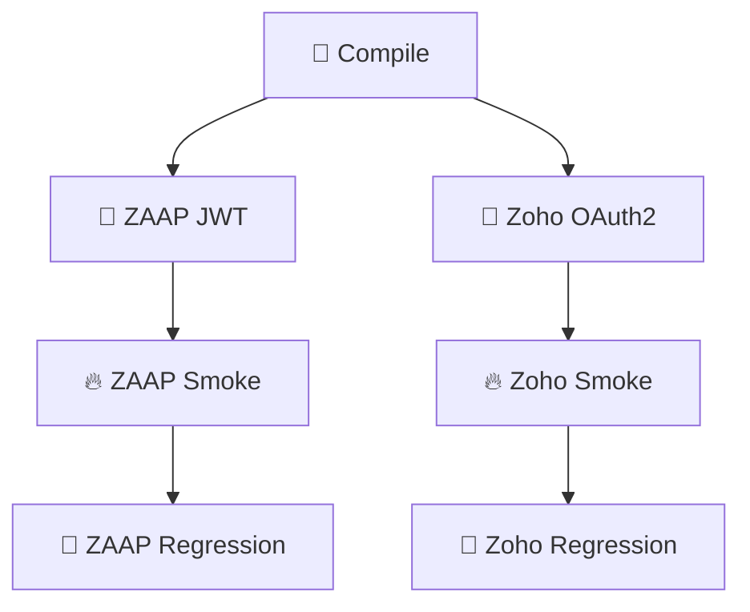
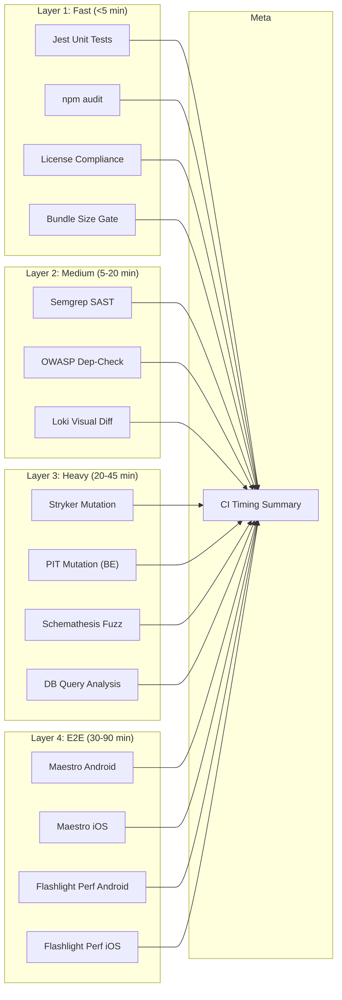
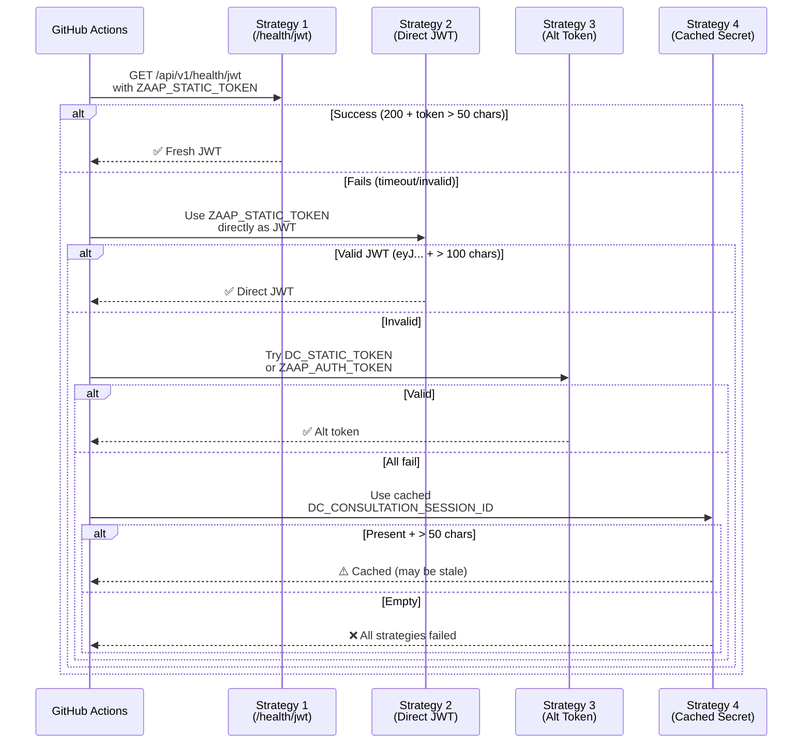

# Onsurity QA — CI/CD Setup & Configuration

> Complete documentation covering **26 GitHub Actions workflows** across two repositories, Docker containerization, EAS mobile builds, token management infrastructure, and local developer tooling.

---

## Table of Contents

1. [Architecture Overview](#architecture-overview)
2. [Repository Map](#repository-map)
3. [QA Automation Pipelines (web-api-qa-automation)](#qa-automation-pipelines)
4. [React Native Pipelines (onsurity-reactnative)](#react-native-pipelines)
5. [Secrets Management](#secrets-management)
6. [Token Refresh Infrastructure](#token-refresh-infrastructure)
7. [Docker & Containerization](#docker--containerization)
8. [EAS Build Configuration](#eas-build-configuration)
9. [Local Developer Tooling](#local-developer-tooling)
10. [Scheduling Matrix](#scheduling-matrix)
11. [Troubleshooting Guide](#troubleshooting-guide)

---

## Architecture Overview

```mermaid
graph TB
    subgraph "GitHub Actions (Cloud CI)"
        direction TB
        QA["web-api-qa-automation<br/>8 Workflows"]
        RN["onsurity-reactnative<br/>18 Workflows"]
    end

    subgraph "Triggers"
        PR["Pull Request"]
        PUSH["Push to Branch"]
        CRON["Nightly Schedule"]
        MANUAL["Manual Dispatch"]
    end

    subgraph "Build Infrastructure"
        JAVA["Java 17 + Maven + Playwright"]
        NODE["Node.js 18/20 + npm"]
        DOCKER["Docker (Playwright Image)"]
        EAS["EAS Build (Expo)"]
    end

    subgraph "Test Execution"
        UI["UI Tests (Playwright)"]
        API["API Tests (REST Assured)"]
        NEWMAN["Newman (Postman Collections)"]
        JEST["Jest (Unit Tests)"]
        MAESTRO["Maestro (E2E Mobile)"]
    end

    subgraph "Quality Gates"
        SEMGREP["Semgrep SAST"]
        DEPCHECK["OWASP Dependency Check"]
        LICENSE["License Compliance"]
        STRYKER["Stryker Mutation Testing"]
        PIT["PIT Mutation Testing (Java)"]
        SCHEMATHESIS["Schemathesis API Fuzz"]
        LOKI["Loki Visual Regression"]
        BUNDLE["Bundle Size Gate"]
    end

    subgraph "Reporting & Artifacts"
        EXTENT["Extent Reports (HTML)"]
        SUREFIRE["Surefire XML Reports"]
        ALLURE["Allure Reports"]
        SUMMARY["GitHub Step Summary"]
        SARIF["GitHub Security Tab (SARIF)"]
    end

    subgraph "Auth Infrastructure"
        ZOHO_REFRESH["Zoho Token Refresh<br/>(Daily Cron)"]
        HC_REFRESH["HC Token Refresh<br/>(launchd on VPN)"]
        DC_JWT["DC JWT Refresh<br/>(Multi-strategy)"]
    end

    PR --> QA & RN
    PUSH --> QA & RN
    CRON --> QA & RN & ZOHO_REFRESH
    MANUAL --> QA & RN

    QA --> JAVA --> UI & API & NEWMAN
    RN --> NODE --> JEST & MAESTRO

    QA --> EXTENT & SUREFIRE & ALLURE
    RN --> SEMGREP & DEPCHECK & LICENSE & STRYKER & PIT & SCHEMATHESIS & LOKI & BUNDLE

    DC_JWT --> QA
    HC_REFRESH --> QA
    ZOHO_REFRESH --> QA
```



---

## Repository Map

| Repository | Purpose | Tech Stack | Workflows |
|---|---|---|---|
| [web-api-qa-automation](https://github.com/OnsurityTechnologies/web-api-qa-automation/tree/main) | QA test automation (UI, API, DB) | Java 17, Maven, Playwright, TestNG, REST Assured | 8 |
| [onsurity-reactnative](file:///Users/boobalakrishnan/Documents/onsurity-reactnative) | Mobile app + shared PR quality gates | React Native, Expo, TypeScript, Jest | 18 |

---

## QA Automation Pipelines

### Pipeline Inventory

| # | Workflow | File | Trigger | Schedule (IST) |
|---|---|---|---|---|
| 1 | Autopay Regression Suite | [autopay-regression.yml](https://github.com/OnsurityTechnologies/web-api-qa-automation/tree/main/.github/workflows/autopay-regression.yml) | `PR`, `dispatch`, `cron` | Mon-Fri 11:30 PM |
| 2 | DC Java API Regression | [dc-java-regression.yml](https://github.com/OnsurityTechnologies/web-api-qa-automation/tree/main/.github/workflows/dc-java-regression.yml) | `push`, `PR`, `dispatch`, `cron` | Mon-Fri 7:00 AM |
| 3 | DC Revamp API Regression | [dc-revamp-regression.yml](https://github.com/OnsurityTechnologies/web-api-qa-automation/tree/main/.github/workflows/dc-revamp-regression.yml) | `PR`, `dispatch`, `cron` | Mon-Fri 1:00 AM |
| 4 | DC Document Upload Regression | [dc-document-upload-regression.yml](https://github.com/OnsurityTechnologies/web-api-qa-automation/tree/main/.github/workflows/dc-document-upload-regression.yml) | `push`, `PR`, `dispatch`, `cron` | Mon-Fri 8:00 AM |
| 5 | HealthCheck API Regression | [healthcheck-regression.yml](https://github.com/OnsurityTechnologies/web-api-qa-automation/tree/main/.github/workflows/healthcheck-regression.yml) | `PR`, `dispatch`, `cron` | Mon-Fri 12:00 AM |
| 6 | HC Java API Regression (Phase 2) | [hc-java-regression.yml](https://github.com/OnsurityTechnologies/web-api-qa-automation/tree/main/.github/workflows/hc-java-regression.yml) | `push`, `PR`, `dispatch`, `cron` | Mon-Fri 7:30 AM |
| 7 | ZAAP + Zoho Regression | [zaap-regression.yml](https://github.com/OnsurityTechnologies/web-api-qa-automation/tree/main/.github/workflows/zaap-regression.yml) | `push`, `PR`, `dispatch`, `cron` | Mon-Fri 7:00 AM |
| 8 | Daily Zoho Token Refresh | [zoho-token-refresh.yml](https://github.com/OnsurityTechnologies/web-api-qa-automation/tree/main/.github/workflows/zoho-token-refresh.yml) | `dispatch`, `cron` | Daily 6:00 AM |

---

### 1. Autopay Regression Suite

> **Scope:** End-to-end Autopay payment flows (Cards + NB, Success + Failure)

**Jobs:**

| Job | Trigger | Timeout | Purpose |
|---|---|---|---|
| `compile` | PR only | - | Fast compile gate |
| `regression` | dispatch + cron | 30 min | Full E2E with Playwright |

**Configuration:**
```yaml
Environment inputs:  onpremqa | preprod
Browser inputs:      chromium | firefox | webkit
Default env:         onpremqa
Maven profile:       (default — uses testng.xml)
```

**Artifacts:** `target/reports/`, `target/screenshots/`, `target/surefire-reports/` (30-day retention)

---

### 2. DC Java API Regression

> **Scope:** Doctor Consultation API testing (Java framework)

**Jobs:**

| Job | Trigger | Timeout | Purpose |
|---|---|---|---|
| `compile` | All triggers | - | Compile `wellness-dc` profile |
| `dc-regression` | Non-PR | 45 min | Full DC API regression |

**Auth:** Uses `DC_STATIC_TOKEN` secret → auto-fetches fresh DC JWT via `DcApiClient.authenticate()`

**Key Configuration:**
```yaml
Maven profile:    -Pwellness-dc
Suite XML:        src/test/resources/testng-wellness-dc.xml
Suite options:    full | smoke
Environments:     qa | staging | preprod
```

---

### 3. DC Revamp API Regression

> **Scope:** DC Wellness module (AT_CLINIC + HOME_COLLECTION booking flows)

**Jobs:**

| Job | Trigger | Timeout | Purpose |
|---|---|---|---|
| `compile` | PR only | - | Compile gate |
| `dc-regression` | Non-PR | 20 min | Full/partial regression |

**Test Group Resolution:**
```
full             → all tests (no group filter)
smoke            → -Dgroups=dc-smoke
atclinic         → -Dgroups=dc-atclinic
homecollection   → -Dgroups=dc-homecollection
```

---

### 4. DC Document Upload Regression

> **Scope:** Document Upload API (`POST /api/v1/order/{orderId}/document`)

**This is the most sophisticated workflow** with 4 jobs, concurrency control, multi-strategy JWT refresh, auto-issue creation, and Slack notifications.

**Jobs:**



| Job | Trigger | Timeout | Purpose |
|---|---|---|---|
| `refresh-session` | All | - | 4-strategy JWT refresh cascade |
| `compile` | All | 10 min | Compile dc-document-upload profile |
| `smoke` | push, dispatch(smoke) | 10 min | TC-01 PNG Upload |
| `regression` | dispatch, cron | 30 min | Full/partial based on test_group |
| `nightly-notify` | schedule | - | Slack webhook notification |

**Test Group Resolution:**
```
full           → all TCs + DB validations
smoke          → du-tc01
happy-path     → du-happy,du-multi
negative-file  → du-neg-filetype,du-neg-size
negative-auth  → du-neg-auth
negative-order → du-neg-order,du-neg-window,du-neg-partner,du-neg-empty
db-validations → du-db
regression     → all negative + DB (no happy path rerun)
```

**Concurrency Control:**
```yaml
concurrency:
  group: dc-document-upload-${{ github.ref }}
  cancel-in-progress: true
```

**Auto-Issue on Failure:** Creates a GitHub issue with labels `[bug, regression, dc-document-upload, qa-automation]` on nightly/dispatch failures.

---

### 5. HealthCheck API Regression

> **Scope:** HealthCheck booking flows (Smoke + AT_CLINIC + HOME_COLLECTION)

**Similar structure to DC Revamp** with compile → regression flow. Uses `DC_AUTH_TOKEN` secret.

**Test Groups:** `full`, `smoke` (`hc-smoke`), `atclinic` (`hc-atclinic`), `homecollection` (`hc-homecollection`)

---

### 6. HC Java API Regression (Phase 2 — Wallet/Coupon)

> **Scope:** HealthCheck Phase 2 — Wallet/Coupon + Prescription Upload + Newman partner collections

**The most complex workflow in the QA repo** — 5 jobs orchestrating both Java (TestNG) and Postman (Newman) tests across multiple partners.

**Jobs:**



| Job | Purpose | Timeout |
|---|---|---|
| `compile` | Compile healthcheck profile | - |
| `refresh-token` | Validate HC_AUTH_TOKEN (decode JWT expiry) | - |
| `newman-regression` | Newman: healthCheck Core, Redcliff, BetaCura, Healthians | 20 min |
| `hc-smoke` | Java smoke gate | 10 min |
| `hc-regression` | Full Phase 2 regression (Wallet/Coupon + Prescription) | 45 min |

**Newman Collections:**
1. `healthCheck.postman_collection.json` — Core Platform
2. `redcliffAPItesting.postman_collection.json` — Redcliff Partner
3. `betacuraAPItesting.postman_collection.json` — BetaCura Partner
4. `healthiansAPItesting.postman_collection.json` — Healthians Partner

**Suite Options:** `full`, `smoke`, `wallet`, `prescription`, `newman-only`, `java-only`

**HC Auth Strategy:**
```
HC_AUTH_TOKEN → Pre-fetched JWT (24h TTL)
                Refreshed by launchd on VPN machine (scripts/refresh_hc_token.sh)
                hc.qa.onsurity.org is NOT reachable from GitHub runners
```

---

### 7. ZAAP + Zoho Creator Regression

> **Scope:** ZAAP Instant Video Consultation + Zoho Creator Custom APIs

**6 jobs** with independent ZAAP/Zoho token refresh and parallel regression paths.

**Jobs:**



**ZAAP JWT Refresh (3-strategy cascade):**
1. `GET /api/v1/health/jwt` with `ZAAP_STATIC_TOKEN`
2. Use `ZAAP_STATIC_TOKEN` directly as JWT
3. Fallback to `ZAAP_AUTH_TOKEN`

**Zoho OAuth2 Refresh:**
```
POST accounts.zoho.in/oauth/v2/token
  grant_type=refresh_token
  refresh_token=${ZOHO_REFRESH_TOKEN}
  client_id=${ZOHO_CLIENT_ID}
  client_secret=${ZOHO_CLIENT_SECRET}
```

**ZAAP Suite Options:** `full`, `smoke`, `zaap-only`, `zoho-only`, `zaap-book`, `zaap-callback`, `zaap-e2e`, `zoho-confirm`, `zoho-cancel`, `zoho-reschedule`

---

### 8. Daily Zoho Token Refresh

> **Scope:** Auto-refresh Zoho Creator access_token + write back to GitHub Secrets

**Runs daily at 06:00 IST** — 30 min before ZAAP regression.

**Steps:**
1. `POST accounts.zoho.in/oauth/v2/token` → fresh access_token
2. Validate against live Zoho Creator `getDoctor` endpoint
3. Encrypt + PUT to GitHub Secrets API (`ZOHO_ACCESS_TOKEN`)

**Dependencies:** Requires `GH_PAT` with `secrets:write` + `actions:write` permissions. Uses PyNaCl for libsodium encryption.

---

## React Native Pipelines

### Pipeline Inventory

| # | Workflow | File | Category | Trigger |
|---|---|---|---|---|
| 1 | RN PR Jest | [rn-pr-test.yml](file:///Users/boobalakrishnan/Documents/onsurity-reactnative/.github/workflows/rn-pr-test.yml) | Unit Testing | PR |
| 2 | PR · Semgrep SAST | [pr-semgrep.yml](file:///Users/boobalakrishnan/Documents/onsurity-reactnative/.github/workflows/pr-semgrep.yml) | Security | PR, push |
| 3 | Nightly · Semgrep Full-Repo | [pr-nightly-semgrep.yml](file:///Users/boobalakrishnan/Documents/onsurity-reactnative/.github/workflows/pr-nightly-semgrep.yml) | Security | cron, dispatch |
| 4 | PR · OWASP Dep Check + npm audit | [pr-dep-check.yml](file:///Users/boobalakrishnan/Documents/onsurity-reactnative/.github/workflows/pr-dep-check.yml) | Security | PR |
| 5 | PR · License Compliance | [pr-license.yml](file:///Users/boobalakrishnan/Documents/onsurity-reactnative/.github/workflows/pr-license.yml) | Compliance | PR |
| 6 | PR · Stryker Mutation (RN) | [rn-pr-stryker.yml](file:///Users/boobalakrishnan/Documents/onsurity-reactnative/.github/workflows/rn-pr-stryker.yml) | Testing | PR |
| 7 | Nightly · Stryker Full-Repo | [rn-nightly-stryker.yml](file:///Users/boobalakrishnan/Documents/onsurity-reactnative/.github/workflows/rn-nightly-stryker.yml) | Testing | cron, dispatch |
| 8 | PR · Bundle Size Gate | [rn-pr-size-limit.yml](file:///Users/boobalakrishnan/Documents/onsurity-reactnative/.github/workflows/rn-pr-size-limit.yml) | Performance | PR, dispatch |
| 9 | PR · Loki Visual Regression | [rn-pr-loki-visual.yml](file:///Users/boobalakrishnan/Documents/onsurity-reactnative/.github/workflows/rn-pr-loki-visual.yml) | Visual | PR |
| 10 | PR · CI Timing Summary | [pr-ci-timing-summary.yml](file:///Users/boobalakrishnan/Documents/onsurity-reactnative/.github/workflows/pr-ci-timing-summary.yml) | Observability | workflow_run |
| 11 | PR · Test + Check (BE) | [pr-test.yml](file:///Users/boobalakrishnan/Documents/onsurity-reactnative/.github/workflows/pr-test.yml) | Testing | PR |
| 12 | PR · PIT Mutation (BE Java) | [be-pr-pit.yml](file:///Users/boobalakrishnan/Documents/onsurity-reactnative/.github/workflows/be-pr-pit.yml) | Testing | PR |
| 13 | PR · DB Query Analysis | [be-pr-db-query-analysis.yml](file:///Users/boobalakrishnan/Documents/onsurity-reactnative/.github/workflows/be-pr-db-query-analysis.yml) | Performance | PR |
| 14 | PR · Schemathesis API Fuzz | [be-pr-schemathesis.yml](file:///Users/boobalakrishnan/Documents/onsurity-reactnative/.github/workflows/be-pr-schemathesis.yml) | Security | PR |
| 15 | Flashlight Android | [rn-pr-flashlight-android.yml](file:///Users/boobalakrishnan/Documents/onsurity-reactnative/.github/workflows/rn-pr-flashlight-android.yml) | Performance | PR |
| 16 | Flashlight iOS | [rn-pr-flashlight-ios.yml](file:///Users/boobalakrishnan/Documents/onsurity-reactnative/.github/workflows/rn-pr-flashlight-ios.yml) | Performance | PR |
| 17 | Maestro Android | [rn-pr-maestro-android.yml](file:///Users/boobalakrishnan/Documents/onsurity-reactnative/.github/workflows/rn-pr-maestro-android.yml) | E2E Testing | PR |
| 18 | Maestro iOS | [rn-pr-maestro-ios.yml](file:///Users/boobalakrishnan/Documents/onsurity-reactnative/.github/workflows/rn-pr-maestro-ios.yml) | E2E Testing | PR |

---

### PR Quality Gate Stack

When a PR is opened on `onsurity-reactnative`, the following checks run:



**CI Timing Tiers (per Anoop's cycle-time discipline):**
| Duration | Tier | Status |
|---|---|---|
| < 10 min | Excellent | ✅ |
| 10-20 min | OK | ⚠️ |
| 20-45 min | Slow | 🐢 |
| > 45 min | Unacceptable | ❌ |

---

### Key RN Workflow Details

#### Semgrep SAST

**Rule-set partition (Coexistence Model A — Semgrep handles PR-time, SonarQube handles dispatch-only):**
- `p/owasp-top-ten` — Security findings
- `p/secrets` — Secret detection
- `p/javascript` + `p/typescript` + `p/react` — Language-specific rules
- `p/r2c-security-audit` — High-confidence security

**SARIF upload** to GitHub Security tab for centralized vulnerability tracking.

#### Stryker Mutation Testing

- **PR-time:** Mutates only files changed in the PR (diff-mode)
- **Nightly:** Full-repo mutation (90-min timeout)
- **Incremental cache:** `.stryker-tmp/` persisted across runs
- **Thresholds:** ≥60% (low) · ≥80% (high) · <50% breaks build

#### Bundle Size Gate

- **Measurement:** Pure bash (no npm dependency — avoids lockfile conflicts)
- **Limit:** 4 MB source size across `app/`, `components/`, `screens/`, `navigation/`, `utils/`, `hooks/`
- **Baseline:** 664 files, 3.83 MB at `a9166268`

#### License Compliance

**Allowlist:** MIT, Apache-2.0, BSD-2-Clause, BSD-3-Clause, ISC, CC-BY-4.0, CC0-1.0, Unlicense, 0BSD, Python-2.0, MPL-2.0, BlueOak-1.0.0, CC-BY-3.0, Zlib, WTFPL

**Exception:** `hyper-sdk-react@5.0.29` (AGPL metadata — actual license is Apache-2.0 per Juspay commercial relationship)

---

## Secrets Management

### web-api-qa-automation Secrets

| Secret | Used By | Purpose |
|---|---|---|
| `MYSQL_PASSWORD` | Autopay, DC Doc Upload | MySQL database access |
| `MONGO_PASSWORD` | Autopay | MongoDB access |
| `DC_STATIC_TOKEN` | DC Java, HC, DC Doc Upload | DC long-lived JWT |
| `DC_AUTH_TOKEN` | DC Revamp | DC API authentication |
| `DC_CONSULTATION_SESSION_ID` | DC Doc Upload | Manual fallback session JWT |
| `HC_AUTH_TOKEN` | HC Java | Pre-fetched HC JWT (24h TTL) |
| `ZAAP_STATIC_TOKEN` | ZAAP, DC Doc Upload | Onsurity JWT for ZAAP+DC |
| `ZAAP_AUTH_TOKEN` | ZAAP | Direct ZAAP JWT fallback |
| `ZOHO_CLIENT_ID` | ZAAP, Zoho Refresh | Zoho OAuth2 client ID |
| `ZOHO_CLIENT_SECRET` | ZAAP, Zoho Refresh | Zoho OAuth2 client secret |
| `ZOHO_REFRESH_TOKEN` | ZAAP, Zoho Refresh | Zoho long-lived refresh token |
| `ZOHO_ACCESS_TOKEN` | ZAAP, Zoho Refresh | Cached Zoho access token (1h TTL) |
| `GH_PAT` | Zoho Refresh | PAT with secrets:write (for token writeback) |
| `DC_QA_SLACK_WEBHOOK` | DC Doc Upload | Slack notification webhook |

### onsurity-reactnative Secrets

| Secret | Used By | Purpose |
|---|---|---|
| `NVD_API_KEY` | OWASP Dep-Check | NVD vulnerability database API key |
| `MINIO_ACCESS_KEY` | Loki Visual | MinIO S3 access for visual baselines |
| `MINIO_SECRET_KEY` | Loki Visual | MinIO S3 secret |
| `STAGING_BASE_URL` | Schemathesis | BE staging endpoint URL |
| `STAGING_AUTH_TOKEN` | Schemathesis | BE staging auth token |
| `STAGING_DB_HOST` | DB Query Analysis | Staging MySQL host |
| `STAGING_DB_RO_USER` | DB Query Analysis | Read-only DB user |
| `STAGING_DB_RO_PASS` | DB Query Analysis | Read-only DB password |
| `STAGING_DB_NAME` | DB Query Analysis | Staging database name |

---

## Token Refresh Infrastructure

### Multi-Strategy JWT Refresh Cascade

The QA automation uses a layered authentication strategy to ensure test stability:



### HC Token Auto-Refresh (Local VPN Machine)

Since `hc.qa.onsurity.org` is **not reachable** from GitHub runners, a local VPN machine handles token refresh:

**Script:** [refresh_hc_token.sh](https://github.com/OnsurityTechnologies/web-api-qa-automation/tree/main/scripts/refresh_hc_token.sh)

**Flow:**
1. Check VPN reachability → `dc.qa.onsurity.org/api/v1/health`
2. Fetch HC JWT → `GET dc.qa.onsurity.org/api/v1/health/jwt?userId=662764a3317f5bba50938a57`
3. Parse token → Decode JWT expiry
4. Push to GitHub Secret → `gh secret set HC_AUTH_TOKEN`
5. macOS notification (success/failure)

**launchd Installation:**
```bash
cp scripts/com.onsurity.hc-token-refresh.plist ~/Library/LaunchAgents/
launchctl load ~/Library/LaunchAgents/com.onsurity.hc-token-refresh.plist
```

**Logs:** `~/.onsurity/logs/hc_token_refresh.log` (auto-rotated at 5 MB)

### Zoho Token Auto-Refresh (GitHub Actions)

**Workflow:** [zoho-token-refresh.yml](https://github.com/OnsurityTechnologies/web-api-qa-automation/tree/main/.github/workflows/zoho-token-refresh.yml)

**Schedule:** Daily 06:00 IST (00:30 UTC) — 30 min before ZAAP regression

**Flow:**
1. OAuth2 refresh → `POST accounts.zoho.in/oauth/v2/token`
2. Validate → Ping `getDoctor` API
3. Encrypt + write → GitHub Secrets API (PyNaCl/libsodium)

---

## Docker & Containerization

### Dockerfile

[Dockerfile](https://github.com/OnsurityTechnologies/web-api-qa-automation/tree/main/Dockerfile) — Multi-stage build:

```dockerfile
# Stage 1: Build
FROM maven:3.9-eclipse-temurin-17 AS builder
# ... compile project

# Stage 2: Runtime
FROM mcr.microsoft.com/playwright/java:v1.49.0-noble
# ... copy compiled project + run tests
```

**Environment Variables:**
| Variable | Default | Description |
|---|---|---|
| `ENV` | `onpremqa` | Target environment |
| `BROWSER` | `chromium` | Browser engine |
| `HEADLESS` | `true` | Headless mode |

**Usage:**
```bash
# Build
docker build -t onsurity-automation .

# Run with report volume mount
docker run --rm \
  -e ENV=onpremqa \
  -e BROWSER=chromium \
  -e HEADLESS=true \
  -v $(PWD)/target/reports:/app/target/reports \
  onsurity-automation
```

---

## EAS Build Configuration

### Build Profiles

[eas.json](file:///Users/boobalakrishnan/Documents/onsurity-reactnative/eas.json) — 6 build profiles:

| Profile | APP_ENV | Distribution | Android | iOS |
|---|---|---|---|---|
| `development` | - | internal | APK | Simulator |
| `preview` | - | internal | APK | Simulator |
| `staging` | `stagingEnv` | internal | APK | Simulator |
| `qa` | `qaEnv` | internal | APK | Simulator |
| `preprod` | `preprodEnv` | internal | APK | Simulator |
| `production` | `productionEnv` | store | AAB | Device |

### Environment Routing

[app.config.ts](file:///Users/boobalakrishnan/Documents/onsurity-reactnative/app.config.ts) resolves `APP_ENV` → environment-specific config:

| APP_ENV | Name | Gateway | iOS Bundle | Android Package |
|---|---|---|---|---|
| `stagingEnv` | Onsurity Staging | `gateway.stage.onsurity.com` | `com.onsurity.onsure` | `com.onsurity.dev` |
| `qaEnv` | Onsurity-QA | `gateway.qa.onsurity.org` | `com.onsurity.qa` | `com.onsurity.tech` |
| `preprodEnv` | Onsurity-PP | `backend-platform-apigateway.preprod-eks.onsurity.com` | `com.onsurity.preprod` | `com.onsurity.preprod` |
| `productionEnv` | Onsurity | `gateway.onsurity.com` | `com.onsurity.onsure` | `com.onsurity` |

### Build Commands

```bash
# QA build (iOS)
eas build --profile qa --platform ios

# QA build (Android)
eas build --profile qa --platform android

# Production build
eas build --profile production --platform all

# Submit to stores
eas submit --profile production --platform ios
```

---

## Local Developer Tooling

### Makefile Commands

[Makefile](https://github.com/OnsurityTechnologies/web-api-qa-automation/tree/main/Makefile):

| Command | Description |
|---|---|
| `make test` | Run full suite (headless) |
| `make test-headed` | Run with visible browser |
| `make test-autopay` | Autopay tests only |
| `make test-wellness-dc` | DC Wellness full suite |
| `make test-wellness-dc-smoke` | DC Wellness smoke only |
| `make test-healthcheck` | HealthCheck full suite |
| `make test-healthcheck-smoke` | HealthCheck smoke only |
| `make test-smoke` | Quick compile check |
| `make report` | Open Extent Report |
| `make failures` | Open failures-only report |
| `make logs` | Tail automation log |
| `make clean` | Clean build + logs |
| `make clean-all` | Deep clean (+ screenshots, traces, videos) |
| `make docker-build` | Build Docker image |
| `make docker-run` | Run tests in Docker |

### Maven Profiles

[pom.xml](https://github.com/OnsurityTechnologies/web-api-qa-automation/tree/main/pom.xml) — 5 build profiles:

| Profile | Suite XML | Purpose |
|---|---|---|
| `(default)` | `testng-claimx.xml` | Default test suite |
| `save-session` | - | Run `SaveAdminSession` utility |
| `wellness-dc` | `testng-wellness-dc.xml` | DC Wellness + ZAAP + Zoho |
| `dc-document-upload` | `testng-wellness-dc-document-upload.xml` | Document Upload API tests |
| `healthcheck` | `testng-healthcheck.xml` | HealthCheck API tests |
| `betacura` | `testng-betacura.xml` | BetaCura partner tests |

### Chrome Debug Script

[start-chrome-debug.sh](https://github.com/OnsurityTechnologies/web-api-qa-automation/tree/main/start-chrome-debug.sh) — Restarts Chrome with remote debugging on port 9222 for local Playwright debugging.

---

## Scheduling Matrix

All times in **IST (UTC+5:30)**:

```mermaid
gantt
    title Nightly CI Schedule (Mon-Fri, IST)
    dateFormat HH:mm
    axisFormat %H:%M

    section Token Refresh
    Zoho Token Refresh      :06:00, 5m

    section QA Regression
    HealthCheck API         :00:00, 20m
    DC Revamp API           :01:00, 20m
    DC Java API             :07:00, 45m
    ZAAP + Zoho             :07:00, 60m
    HC Java Phase 2         :07:30, 45m
    DC Document Upload      :08:00, 30m
    Autopay                 :23:30, 30m

    section RN Nightly
    Nightly Semgrep         :07:30, 30m
    Nightly Stryker         :07:30, 90m
```



| Time (IST) | Cron (UTC) | Workflow |
|---|---|---|
| 12:00 AM | `30 18 * * 1-5` | HealthCheck API Regression |
| 1:00 AM | `30 19 * * 1-5` | DC Revamp API Regression |
| 6:00 AM | `30 0 * * *` | Zoho Token Refresh (daily) |
| 7:00 AM | `30 1 * * 1-5` | DC Java API + ZAAP Regression |
| 7:30 AM | `0 2 * * 1-5` | HC Java Phase 2 + Nightly Semgrep/Stryker |
| 8:00 AM | `30 2 * * 1-5` | DC Document Upload Regression |
| 11:30 PM | `0 18 * * 1-5` | Autopay Regression |

---

## Troubleshooting Guide

### Common Issues

#### ❌ "All strategies failed — no valid session token"
**Cause:** All JWT refresh strategies exhausted
**Fix:**
1. Check `ZAAP_STATIC_TOKEN` is set and starts with `eyJ`
2. Verify `dc.qa.onsurity.org` is up
3. Manually update `DC_CONSULTATION_SESSION_ID` as last resort

#### ❌ HC_AUTH_TOKEN expired
**Cause:** VPN machine launchd job failed or VPN disconnected
**Fix:**
```bash
# Check launchd status
launchctl list | grep hc-token

# View refresh logs
tail -50 ~/.onsurity/logs/hc_token_refresh.log

# Manual refresh (while VPN connected)
scripts/refresh_hc_token.sh
```

#### ❌ Zoho access_token refresh failed
**Cause:** ZOHO_REFRESH_TOKEN revoked or client credentials changed
**Fix:**
1. Re-generate refresh token at `accounts.zoho.in`
2. Update `ZOHO_REFRESH_TOKEN` in repo secrets
3. Run `zoho-token-refresh.yml` manually

#### ⚠️ Node.js 24 warnings
**Context:** GitHub runners deprecated Node.js 20 (June 2026)
**Solution:** All newer workflows include:
```yaml
env:
  FORCE_JAVASCRIPT_ACTIONS_TO_NODE24: 'true'
```

#### ⚠️ VPN-dependent tests skipping
**Cause:** `onpremqa` environment requires VPN access
**Status:** VPN auto-connect is commented out in workflows:
```yaml
# Uncomment when VPN secrets are added:
# - name: Connect VPN
#   uses: kota65535/github-openvpn-connect-action@v3
```

### Code Ownership

[CODEOWNERS](https://github.com/OnsurityTechnologies/web-api-qa-automation/tree/main/.github/CODEOWNERS):
```
* @boobalakrishnan89 @chandrasekharc005 @sahilnarang-onsurity @syedfarookhON @tirumaleshrao770 @soumya-nayak152
```

---

> [!TIP]
> To manually trigger any workflow: **GitHub → Actions → Select workflow → Run workflow** (choose environment + suite options from the dropdown).

> [!IMPORTANT]
> Token secrets (`HC_AUTH_TOKEN`, `ZOHO_ACCESS_TOKEN`) are auto-refreshed. If nightly regressions start failing with auth errors, check the refresh jobs first before manually updating tokens.
